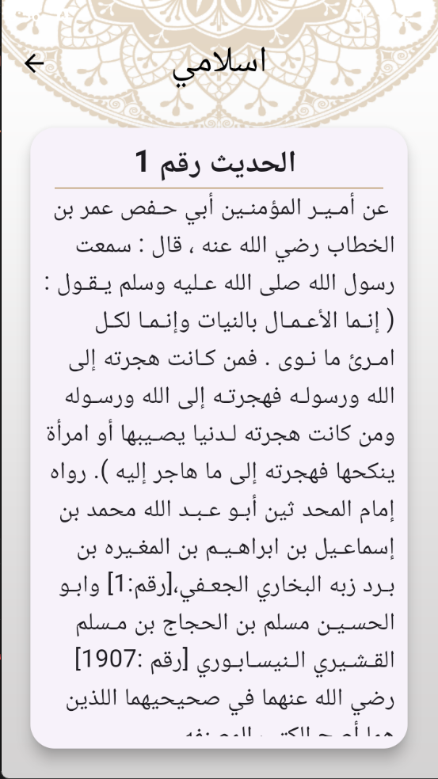
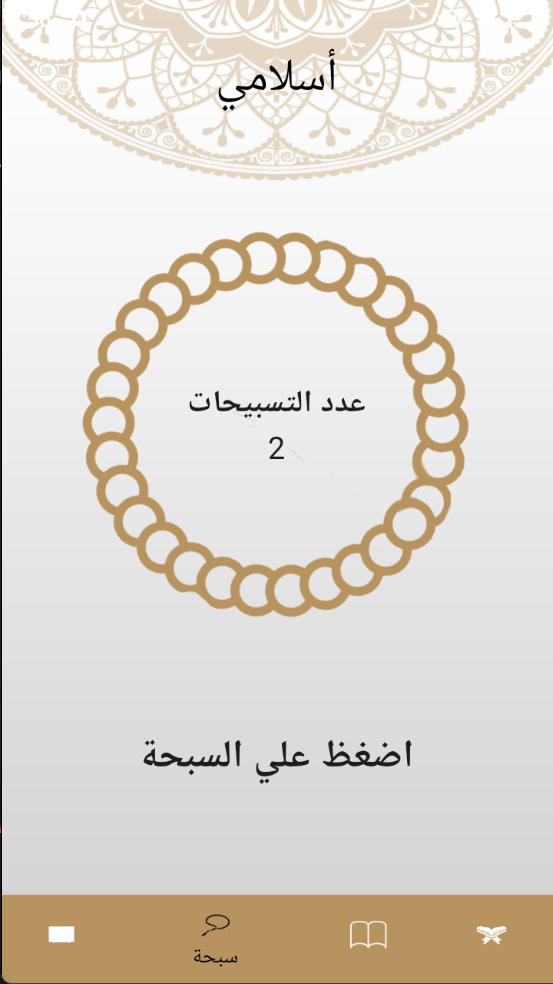
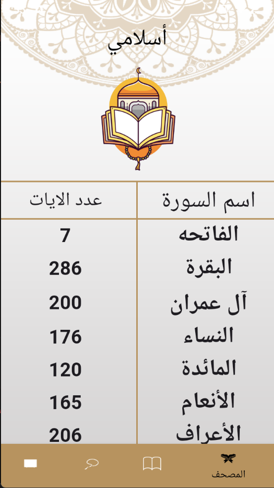
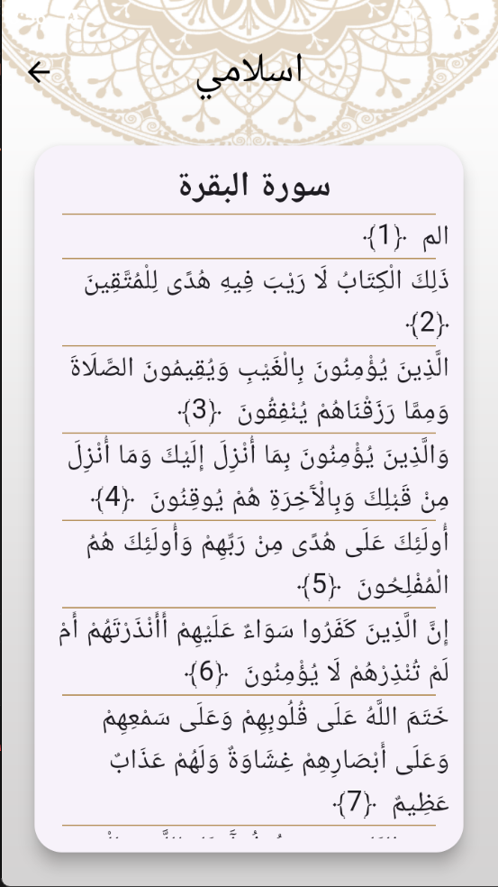
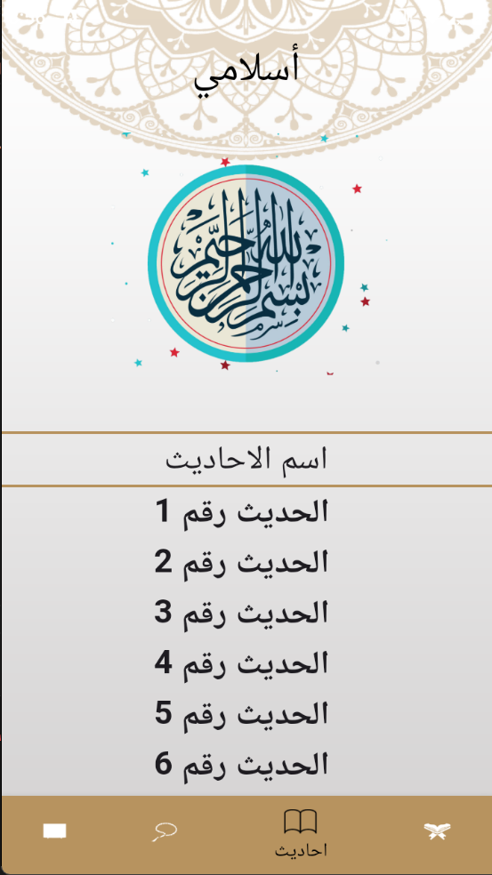
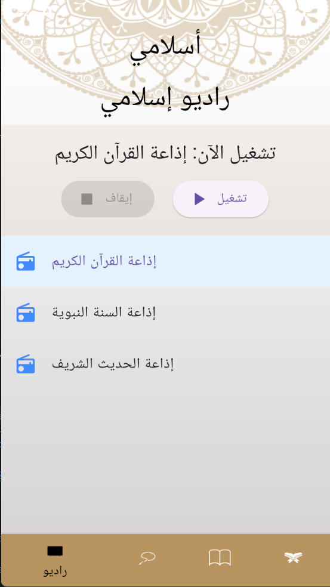

# Islamic App 🕌

The **Islamic App** is a comprehensive mobile application designed to provide users with a complete Islamic experience, offering a wide range of features, resources, and tools to enhance their spiritual journey and knowledge of Islam.

📱 Built using **Flutter**, this cross-platform app ensures a seamless experience across different devices, allowing users to access Islamic content anytime, anywhere.

---

## Key Features:

- **Quran**: Access the complete Quran with translations in multiple languages, enabling users to read, study, and understand the holy scripture.
  
- **Daily Reminders**: Receive daily Islamic reminders and inspirational quotes to stay connected with your faith and find motivation in your daily life.
  
- **Prayer Times**: Get accurate prayer times based on your location, ensuring you never miss a prayer and can perform them on time.
  
- **Qibla Direction**: Locate the Qibla direction using the app's built-in compass feature, assisting you in finding the correct direction for prayer, no matter where you are.
  
- **Duas and Supplications**: Explore a vast collection of authentic duas (supplications) for various occasions, allowing users to seek guidance, blessings, and support from Allah.
  
- **Islamic Calendar**: Stay informed about important Islamic dates, holidays, and events, helping you plan and observe significant occasions in accordance with the Islamic calendar.
  
- **Islamic Articles and Resources**: Access a wide range of articles, videos, audio, and resources covering various aspects of Islam, including Islamic teachings, history, spirituality, and more.
  
- **Community and Social Features**: Engage with a community of fellow Muslims, participate in discussions, share content, and connect with like-minded individuals.

---

## ⭐️ If you find this project useful, please give it a star! ⭐️  
Your support helps me to keep improving and maintaining this project. Thank you!

---

## Technologies and Tools:

- 🦄 **Flutter**: The framework used for developing cross-platform mobile applications.
- 💻 **Dart**: The programming language utilized in Flutter development.
- 🌐 **API Integrations**: Integration with Islamic APIs and services to retrieve accurate prayer times, Quran translations, and other relevant information.
- 📱 **Responsive Design**: Ensuring the app's layout and components adapt to different screen sizes and orientations.

---

## Screenshots of the App

Here are some screenshots showcasing the key features of the **Islamic App**:

### First Hadith Page  

### Sibaha Page  

### Quran Page  

### Surah Al-Baqara  

### Hadith Page  

### Radio Page  

---

## Connect with Us

For questions or suggestions, feel free to reach out via [Your Email].  
Check out the code on [GitHub](https://github.com/Islam-Ragab015?tab=repositories).

---

🌟 May this app serve as a valuable companion on your journey of faith and knowledge in Islam. 🕌✨
